# Illustrated Startup Guide for Non-Developers

This documentation will help you host the recovery app locally. This ensures the service remains available even if the Elytro team is no longer maintaining it.

1. Download the Elytro repository
   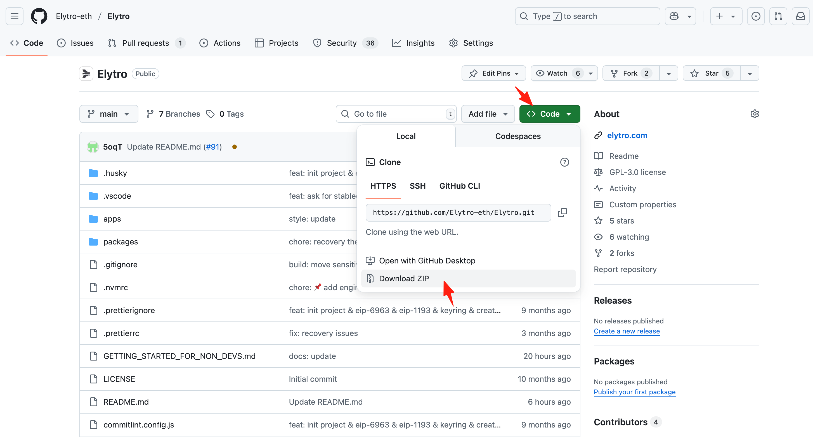

2. Open your terminal and navigate to the repository directory
   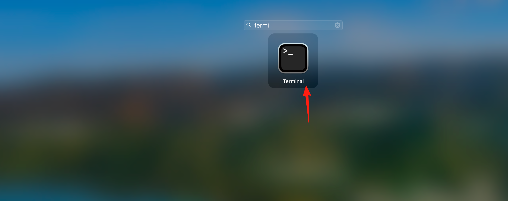
   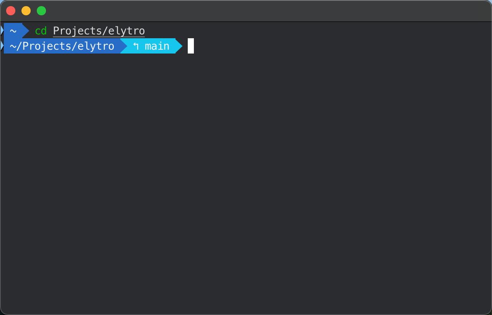
3. Install Node.js & pnpm
   See [here](https://nodejs.org/en/download/) for detailed installation scripts. Choose these versions carefully: Node.js v22.15.x, pnpm 9.x

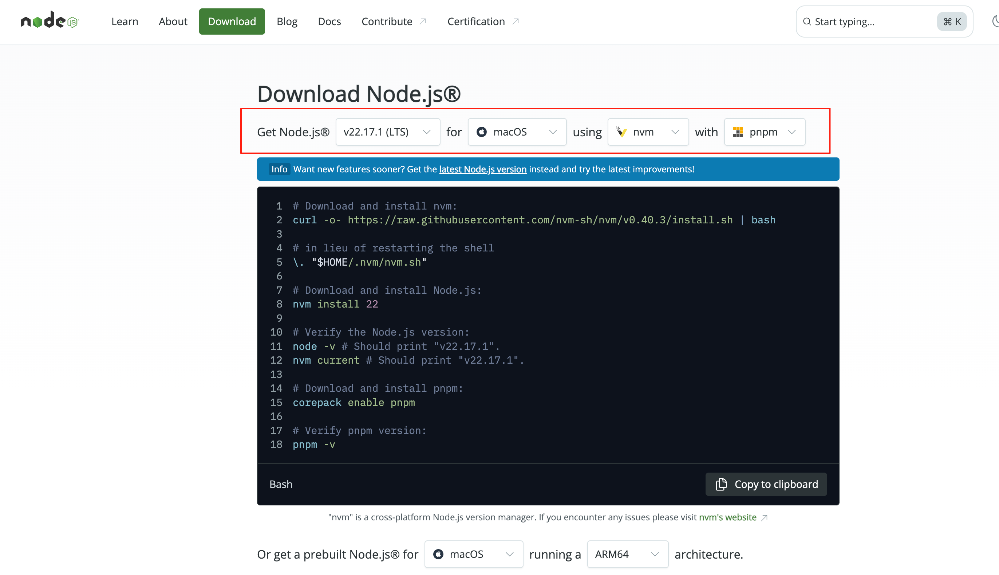
For your convenience, copy these shell commands to your terminal:

```shell
# Download and install nvm:
curl -o- https://raw.githubusercontent.com/nvm-sh/nvm/v0.40.3/install.sh | bash
# in lieu of restarting the shell
\. "$HOME/.nvm/nvm.sh"
# Download and install Node.js:
nvm install 22.15.x
# Verify the Node.js version:
node -v # Should print "v22.15.x".
nvm current # Should print "v22.15.x".
# Download and install pnpm:
corepack enable pnpm@9
# Verify pnpm version:
pnpm -v
```

The output should look like this:

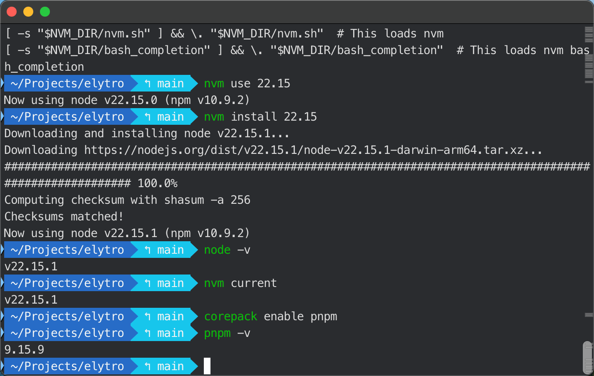

4. Install dependencies
   Run `pnpm install` in the project root directory to install all required dependencies for both the extension and recovery app.

   ```shell
   pnpm install
   ```

   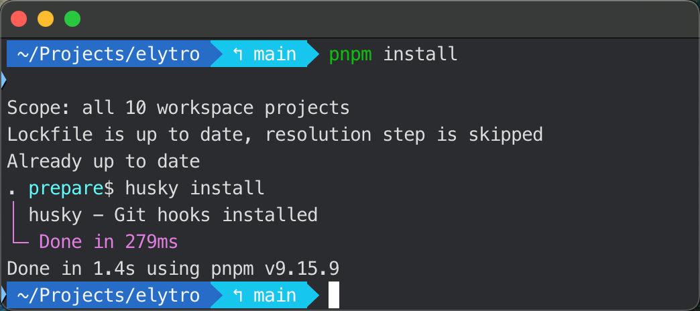

5. Build and start the extension locally
   Run the following command to build the extension:

   ```shell
   cd apps/extension
   pnpm build
   ```

   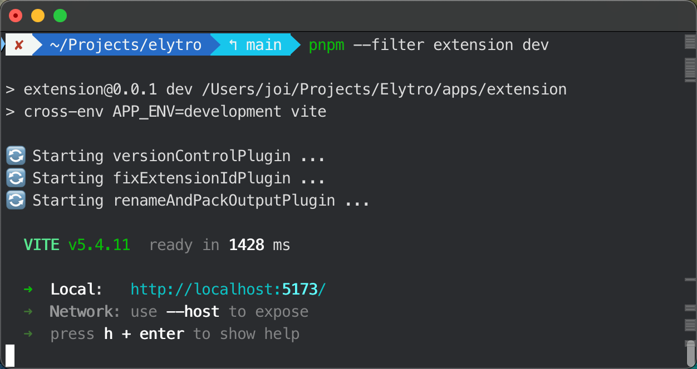
   Then visit `chrome://extensions/` in your Chrome browser and use the `dist` folder we just built to load your own Elytro extension wallet.
   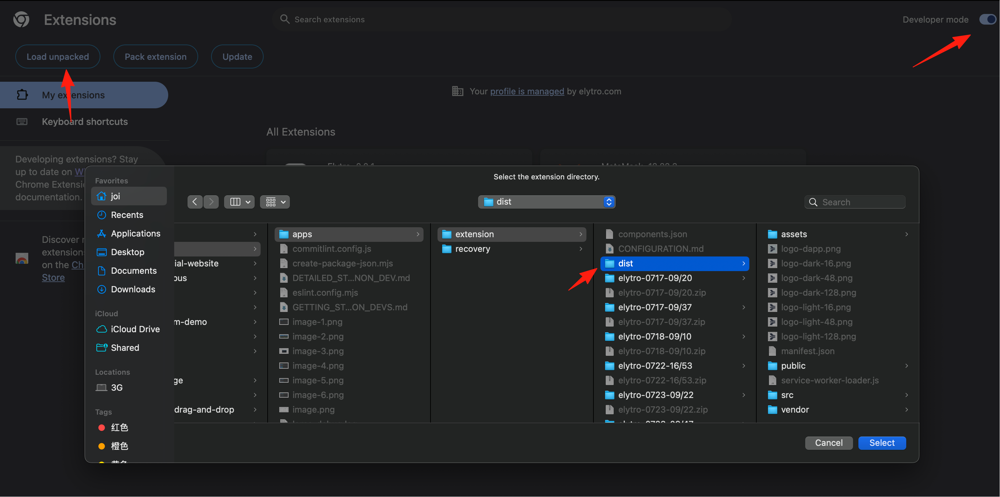

6. Start the recovery app locally
   Run the following command to start the recovery app:
   ```shell
   cd apps/recovery
   pnpm dev
   ```
   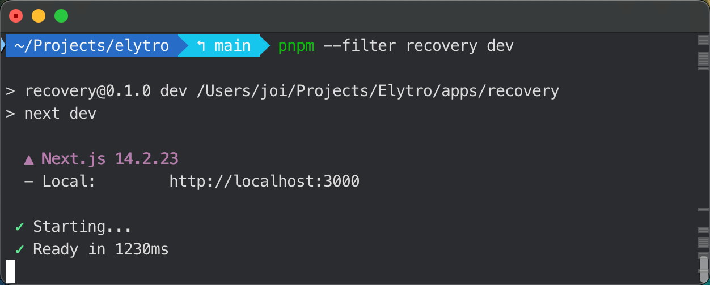

You should be able to visit the recovery app in your browser by pasting the URL `http://localhost:3000` that your terminal displays.
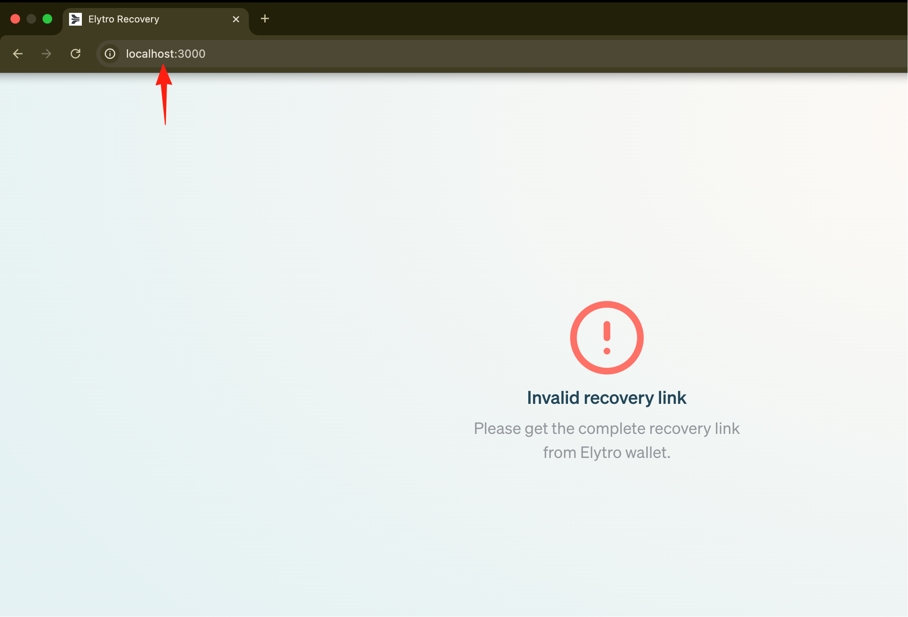

## Getting Recovery Parameters

To use the recovery app, you need a valid recovery link with required parameters like `id`, `address`, `chainId`, etc. For example:

```
http://localhost:3000?id=0x16c8d383580cf86db99e2ec27e5adc06b4e558a5de12fd649a06e112e15146be&address=0x9261229B5a58891B7cCe9744cF94D5b6869946a5&chainId=11155111&approveHash=0x4deb94be66fb4a041f05a0d9116b68de53bfdc34c0c2277269f898234c32f4a2&from=8405819&owner=0xf937057d2cf299D60e2066740f5508B78a3048eb
```

Don't worry - you can get these parameters easily by starting a recovery process in your wallet extension.

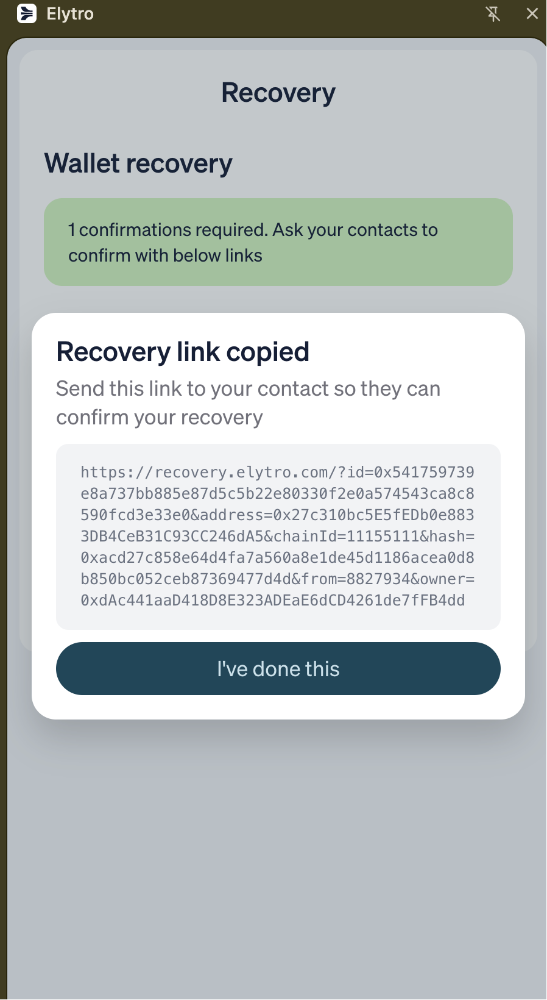

## Troubleshooting

- **Node.js version issues**: Make sure you're using exactly Node.js v22.15.x as specified
- **Permission errors**: On macOS/Linux, you might need to restart your terminal after installing nvm
- **Extension not loading**: Make sure you've built the extension first with `pnpm build` in the `apps/extension` directory
- **Recovery app not starting**: Ensure all dependencies are installed with `pnpm install` in the project root
- **Port conflicts**: If port 3000 is already in use, Next.js will automatically use the next available port
