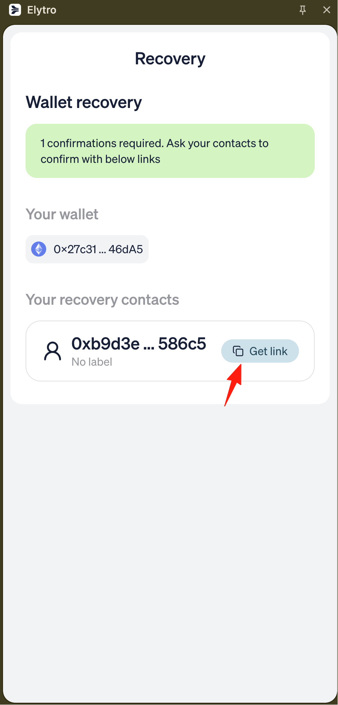

> **IMPORTANT FOR NON-DEVELOPERS:**
> If you are not a developer and want to run Elytro locally, please read [GETTING_STARTED_FOR_NON_DEVS.md](../../GETTING_STARTED_FOR_NON_DEVS.md) first for a simple, step-by-step guide!

# Elytro Recovery App

A web application for secure social recovery, allowing Elytro Wallet users to regain access to their accounts with help from designated recovery contacts. This app allows recovery contacts to help wallet owners regain access to their accounts through a secure, multi-step verification process.

## Features

- **Social Recovery Interface**: Intuitive web interface for recovery contacts to assist wallet recovery
- **Multi-Step Process**: Guided recovery flow with signature collection and execution phases
- **Real-time Status Tracking**: Live updates on recovery progress and transaction status
- **Wallet Integration**: Connect with MetaMask and other Web3 wallets via Wagmi
- **Cross-Chain Support**: Compatible with multiple EVM-compatible networks
- **Smart Contract Integration**: Direct interaction with Elytro's Social Recovery Module

## Architecture

| Component          | Technology                     |
| ------------------ | ------------------------------ |
| Frontend Framework | Next.js 14 (App Router)        |
| Web3 Integration   | Wagmi v2 + Viem                |
| State Management   | React Context + TanStack Query |
| UI Framework       | Tailwind CSS + Radix UI        |
| GraphQL Client     | Apollo Client                  |

## Prerequisites

- Node.js 22.15.0 or higher
- pnpm package manager
- Web3 wallet (MetaMask, etc.) for testing
- (Optional) API keys for blockchain infrastructure services such as Alchemy or Pimlico — not required if using public RPC endpoints

## Getting Started

### Installation

1. **Navigate to the recovery app directory:**

```bash
cd apps/recovery
```

2. **Install dependencies:**

```bash
pnpm install
```

### Environment Configuration

3. **Create environment file:**

```bash
# Create .env file in the root directory
touch .env
```

4. **(Optional) Add required API keys:**

```env
# Alchemy API Key (for RPC connections)
VITE_ALCHEMY_API_KEY=your_alchemy_api_key

# Pimlico API Key (for account abstraction services)
VITE_PIMLICO_API_KEY=your_pimlico_api_key
```

Replace the placeholder values with your actual API keys from:

- [Alchemy](https://www.alchemy.com/) - For blockchain RPC access
- [Pimlico](https://pimlico.io/) - For ERC-4337 bundler services

### Development

5. **Start the development server:**

```bash
pnpm dev
```

The app will be available at [http://localhost:3000](http://localhost:3000)

### Building

6. **Build for production:**

```bash
# Create production build
pnpm build

# Start production server
pnpm start
```

### Code Quality

```bash
# Run ESLint
pnpm lint

# Format code with Prettier
pnpm format
```

## Project Structure

```
src/
├── app/                    # Next.js app router pages
│   ├── contacts/          # Contact verification page
│   ├── start/             # Recovery execution page
│   ├── finished/          # Completion page
│   ├── layout.tsx         # Root layout with providers
│   └── page.tsx           # Home/dashboard page
├── components/            # React components
│   ├── ui/               # Base UI components (Radix UI)
│   ├── AddressWithChain.tsx
│   ├── ConnectControl.tsx
│   ├── ContentWrapper.tsx
│   └── LogoHeader.tsx
├── constants/            # App constants and configurations
│   ├── chains.ts         # Supported blockchain networks
│   ├── contracts.ts      # Smart contract ABIs and addresses
│   └── enums.ts         # Status enums and types
├── contexts/            # React context providers
│   ├── index.tsx        # Recovery record context
│   └── rpc-context.tsx  # RPC configuration context
├── hooks/               # Custom React hooks
├── lib/                 # Utility libraries
├── requests/           # API and GraphQL clients
└── wagmi.ts           # Wagmi configuration
```

## Recovery Process

### 1. Initial Setup

- User accesses the recovery app with a recovery request URL
- App fetches recovery record details from the blockchain
- Displays recovery status and required contacts

### 2. Contact Verification (`/contacts`)

- Recovery contacts connect their wallets
- Contacts review and sign recovery requests
- App tracks signature collection progress

### 3. Recovery Execution (`/start`)

- Initiates the recovery process on-chain
- Displays countdown timer for delay period
- Executes final recovery transaction

### 4. Completion (`/finished`)

- Confirms successful wallet recovery
- Directs user to access recovered wallet

## Configuration

### Supported Networks

The app supports multiple EVM-compatible networks configured in `src/constants/chains.ts`. Each network requires:

- Chain ID and name
- RPC endpoints
- Block explorer URLs
- Native currency details

## Development Guidelines

### Adding New Features

1. Follow Next.js App Router conventions
2. Use TypeScript for type safety
3. Implement proper error handling with toast notifications
4. Ensure responsive design for all screen sizes
5. Add loading states for async operations

### State Management

- Use React Context for global recovery state
- TanStack Query for server state and caching
- Wagmi hooks for Web3 state management

### Error Handling

- Comprehensive error boundaries
- User-friendly error messages
- Fallback UI for failed states
- Transaction failure recovery

## Security Considerations

- **Smart Contract Verification**: All contract interactions use verified ABIs
- **Signature Validation**: EIP-712 signatures for secure message signing
- **Time Delays**: Enforced delay periods prevent immediate unauthorized access
- **Multi-Signature**: Requires multiple guardian confirmations
- **Client-Side Validation**: Input validation and sanitization

## Troubleshooting

### Common Issues

1. **"Recovery record not found"**

   - Verify the recovery URL parameters are correct
   - Ensure the wallet address has an active recovery configuration

   

2. **"Connected wallet is not a recovery contact"**

   - Switch to a wallet address that's configured as a recovery contact
   - Verify the recovery contact list in the original wallet

3. **"Transaction failed"**

   - Check wallet connection and network
   - Ensure sufficient gas fees
   - Verify contract interaction permissions

4. **"API key errors"**
   - Verify API keys are correctly set in `.env` file
   - Check API key permissions and rate limits

### Development Tips

- Use browser developer tools to debug Web3 interactions
- Monitor network requests for API failures
- Check console for detailed error messages
- Test with different wallet providers

## Future Improvements

Based on the TODO comments in the codebase:

- **Shared Components**: Extract reusable components to `libs/shared-components`
- **Shared Configuration**: Create common Tailwind and build configs for the monorepo
- **Enhanced Error Handling**: More granular error states and recovery options
- **Mobile Optimization**: Improved mobile experience and PWA capabilities
- **Multi-Language Support**: Internationalization for global users

## Contributing

1. Follow the existing code style and TypeScript conventions
2. Use the configured ESLint and Prettier settings
3. Ensure all components are accessible and responsive
4. Test recovery flows with different wallet providers
5. Update documentation for new features

## Links

- [ERC-4337 Account Abstraction](https://eips.ethereum.org/EIPS/eip-4337)
- [Elytro Wallet Extension](../extension/README.md)
- [Next.js Documentation](https://nextjs.org/docs)
- [Wagmi Documentation](https://wagmi.sh/)
- [Radix UI Components](https://www.radix-ui.com/)
